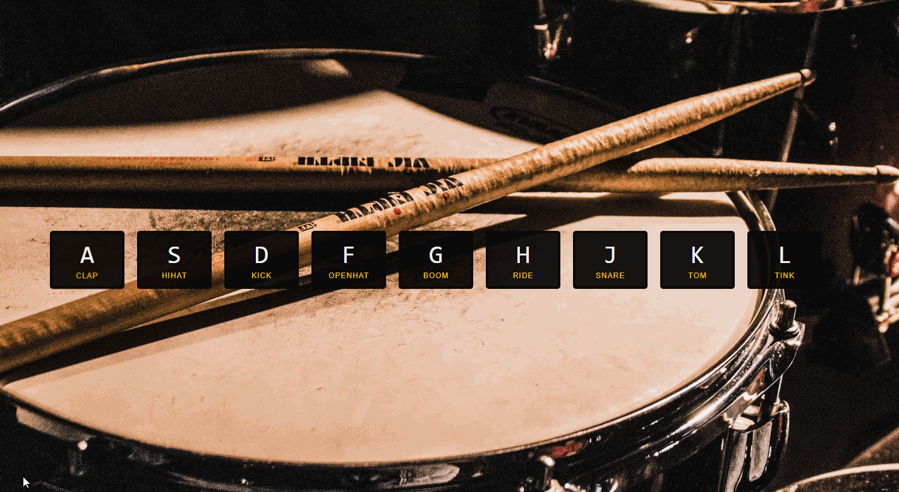

# Super Galactic Age Calculator

<html>
<!-- Project Shields -->
    

        
		  ¨
        
        ¨
        
        ¨
        
        ¨
        
    
 
</html>

### This app lets user play hit the drum tumes using keyboard

\

#### By Roman Kolivashko

## Technologies Used

* _HTML_
* _CSS_
* _JavaScript ES6_

## Description
Press any of "ASDFGHJKL" to play a drum sound. 

## Setup/Installation Requirements

1. Click on "Code" button at top of GitHub repository. 
2. Clone the repository: `$ git clone https://github.com/romankolivashko/drum-kit.git`
3. Navigate to the drum-kit/ directory on your computer
4. launch index.html in any browser 

## How to access the app from the web and hear the sound of a drum
* _Follow the link [here](https://goofy-mcnulty-e3b785.netlify.app/)_ 
## Known Bugs

* _None so far_

## License
MIT
## Contact Information
rkolivashko@gmail.com
